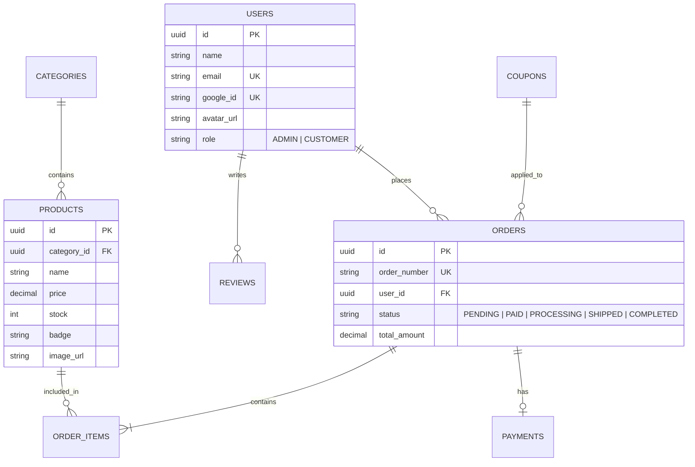
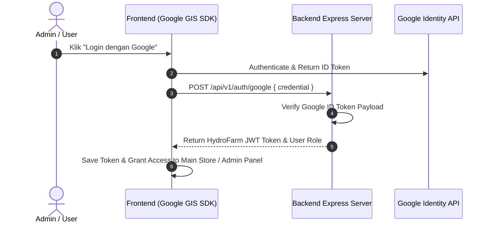

# 🚀 System Architecture & Implementation Plan: HydroFarm

Dokumen ini berisi rancangan arsitektur sistem lengkap, struktur direktori terpisah untuk **Backend** dan **Frontend** (Main Store & Admin Panel), skema basis data, spesifikasi RESTful API, integrasi Google OAuth 2.0, serta Payment Gateway Midtrans.

---

## 📂 1. Structure Directory Overview

```
c:\Kerja\design figma\
├── backend/                   # Express.js + TypeScript API Server
│   ├── package.json
│   ├── tsconfig.json
│   ├── .env                   # Environment Variables & Google OAuth Keys
│   ├── .env.example
│   ├── prisma/
│   │   └── schema.prisma      # PostgreSQL Database Schema
│   └── src/
│       ├── controllers/       # Auth, Products, Coupons, Orders, Payments
│       ├── middlewares/       # JWT Auth & Error Handling
│       ├── routes/            # REST API Endpoint Routers
│       ├── types/             # TypeScript Type Definitions
│       ├── data/              # Data Store & Seeder
│       └── index.ts           # Server Entrypoint
│
└── frontend/                  # Client Applications
    ├── main/                  # E-Commerce Main Storefront
    │   ├── index.html         # Main Store UI
    │   ├── styles.css         # Main Stylesheet
    │   ├── app.js             # Main Interactive App & API Sync
    │   └── assets/            # Product & Category Images
    │
    └── admin/                 # Admin Dashboard Panel
        ├── index.html         # Admin Dashboard UI
        ├── styles.css         # Admin Dashboard Stylesheet
        └── app.js             # Admin Logic, Google Auth & CRUD Operations
```

---

## 📌 2. Technology Stack & Architecture

| Layer | Teknologi / Library | Deskripsi / Fungsi |
| :--- | :--- | :--- |
| **Backend API** | Node.js + Express (TypeScript) | High-performance RESTful API service pada port `5000`. |
| **Database** | PostgreSQL + Prisma ORM | Relational Database untuk ACID compliance transaksi & persediaan stok. |
| **Authentication** | JWT + Google OAuth 2.0 Identity API | Login akun Google & Role-Based Access Control (`ADMIN`, `CUSTOMER`). |
| **Frontend Main** | HTML5, Vanilla CSS, JS (ES6+) | Toko online e-commerce sayuran hidroponik interaktif. |
| **Frontend Admin** | HTML5, Modern CSS Glassmorphism, JS | Panel kontrol manajemen produk, stok, pesanan masuk, dan kupon promo. |
| **Payment Gateway** | Midtrans API | Integrasi pembayaran QRIS, Virtual Account, & E-Wallet. |

---

## 🗄️ 3. Database Schema Design (ERD)



---

## 🔑 4. Google OAuth 2.0 Auth Flow



---

## 📅 5. Tahapan Eksekusi Restrukturisasi Folder

1. **Memindahkan Folder `server/` ke `backend/`**.
2. **Membuat Struktur Folder `frontend/`**:
   - `frontend/main/`: Memindahkan `index.html`, `styles.css`, `app.js`, dan `assets/`.
   - `frontend/admin/`: Memindahkan `admin.html` (menjadi `index.html`), `admin.css` (`styles.css`), dan `admin.js` (`app.js`).
3. **Memperbarui Link Relatif & Path Gambar**:
   - Menyesuaikan referensi aset & navigasi antar `main` dan `admin`.
4. **Verifikasi Server & Frontend Integration**.
